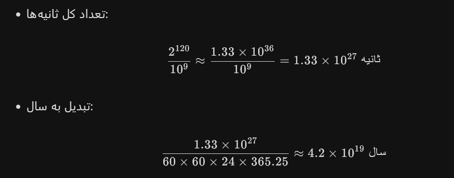
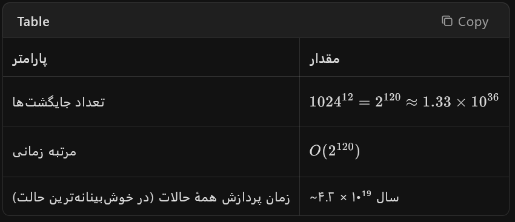

```txt
جایگشت یک جمله ۱۲ کلمه ای از بین ۱۰۲۴ کلمه چقدر میشه و پردازش همه حالات اون چقدر زمان و مرتبه زمانی می بره؟
```

سؤال شما را به دو بخش تقسیم می‌کنم:

1.  **تعداد جایگشت‌های ممکن**
    
2.  **زمان/مرتبه زمانی پردازش همهٔ آن‌ها**
    

* * *

### ۱) تعداد جایگشت‌های ممکن

فرض کنید یک جملهٔ ۱۲ کلمه‌ای داریم و برای هر جایگاه (word position) می‌توانیم هر یک از ۱۰۲۴ کلمهٔ موجود را قرار دهیم. چون جایگشت با تکرار است (بازگشت مجاز است)، تعداد حالات برابر است با:

Total=1024<sup>12</sup>

1024<sup>12</sup>=(2<sup>10</sup>)<sup>12</sup>=2<sup>120</sup>≈1.33×10<sup>36</sup>

**یعنی حدود ۱.۳۳ × ۱۰<sup>36</sup> جایگشت ممکن.**

* * *

### ۲) زمان/مرتبه زمانی پردازش همهٔ حالات

اگر بخواهیم **همهٔ این حالات را پردازش کنیم** (مثلاً ارزیابی یا ذخیرهٔ هر ترکیب)، مرتبه زمانی (Time Complexity) برابر است با:

O(1024<sup>12</sup>)\=O(2<sup>120</sup>)​

#### چقدر زمان می‌برد؟

-   فرض کنیم یک پردازنده بتواند **هر نانوثانیه** (۱۰<sup>⁻⁹</sup> ثانیه) یک حالت را پردازش کند (که بسیار خوش‌بینانه است).
    


**یعنی حدود ۴۲ میلیارد میلیارد سال!** (بسیار بیشتر از عمر کیهان که حدود ۱.۴ × ۱۰¹۰ سال است.)

* * *

### جمع‌بندی



**نتیجه:** پردازش کامل همهٔ حالات ممکن نیست؛ باید از الگوریتم‌های هوشمند، هرس (pruning) یا نمونه‌برداری (sampling) استفاده کرد.

